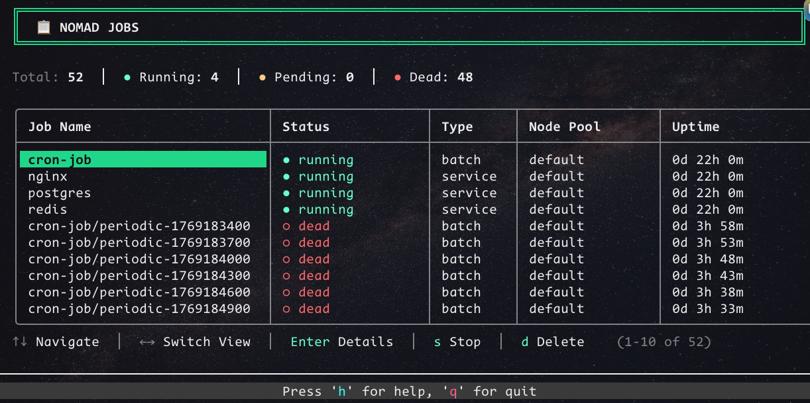
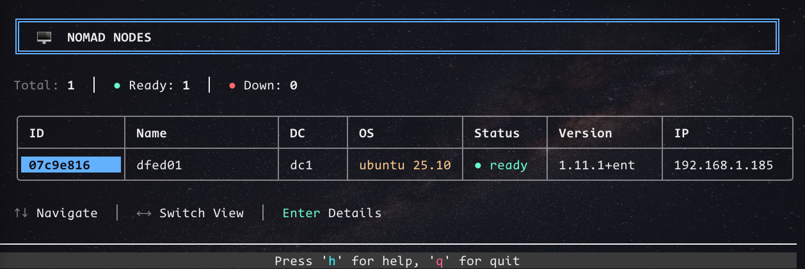
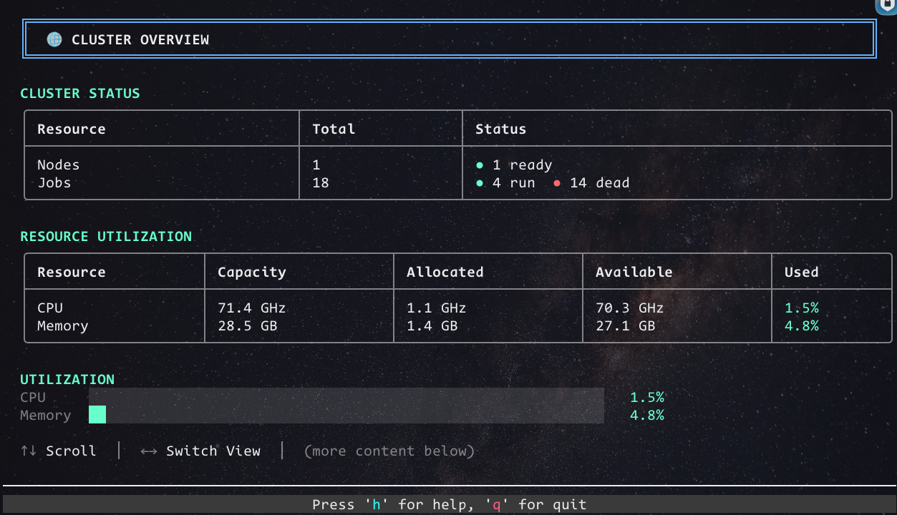
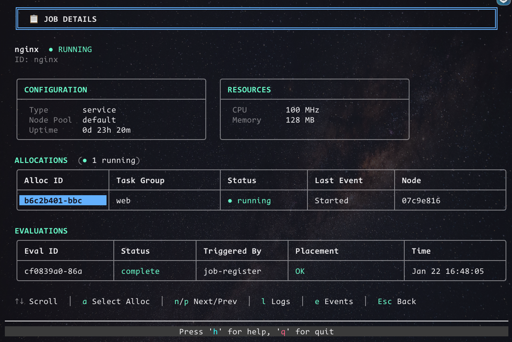
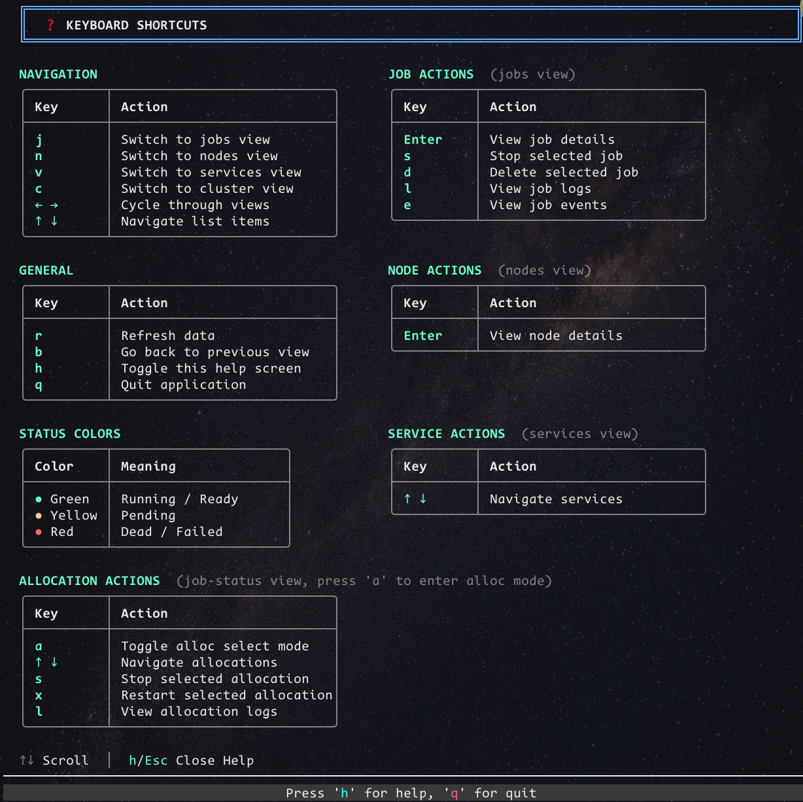

# nomad-top

A beautiful, interactive terminal user interface (TUI) for monitoring and managing HashiCorp Nomad clusters.


<!-- TODO: Add demo GIF screenshot -->

## Features

- 📊 **Real-time Monitoring** - View jobs, nodes, services, and cluster metrics in real-time
- 🎨 **Multiple Color Themes** - Support for Nomad, Vault, Consul, Boundary, Packer, Terraform, Waypoint, and Vagrant themes
- 📱 **Responsive Design** - Automatically adapts to terminal window size
- ⌨️ **Keyboard Navigation** - Full keyboard control with vim-like navigation
- 🔍 **Detailed Views** - Drill down into jobs, nodes, and allocations for detailed information
- 🚀 **Job Management** - Stop, delete, and monitor jobs directly from the TUI
- 📜 **Log Viewing** - View allocation logs in real-time
- 📋 **Event Tracking** - Monitor job events and task state changes
- 🔐 **Secure Connections** - Support for TLS and ACL tokens
- 🎯 **Allocation Management** - Stop, restart, and view logs for individual allocations

## Screenshots

### Jobs View

<!-- TODO: Add jobs view screenshot showing the jobs table with status indicators -->

### Nodes View

<!-- TODO: Add nodes view screenshot showing node list with health status -->

### Cluster Overview

<!-- TODO: Add cluster overview screenshot showing CPU/Memory metrics -->

### Job Details

<!-- TODO: Add job details screenshot showing allocations and evaluations -->

### Help Screen

<!-- TODO: Add help screen screenshot showing all keyboard shortcuts -->

## Installation

### Prerequisites

- Go 1.25.3 or later
- Access to a Nomad cluster

### From Source

```bash
# Clone the repository
git clone https://github.com/yourusername/nomad-top.git
cd nomad-top

# Build the binary
go build -o nomad-top .

# Optionally, move to your PATH
sudo mv nomad-top /usr/local/bin/
```

### Using Go Install

```bash
go install github.com/yourusername/nomad-top@latest
```

## Usage

### Basic Usage

```bash
# Connect to default Nomad server (localhost:4646)
./nomad-top

# Connect to a specific Nomad server
./nomad-top -addr https://nomad.example.com:4646

# Use ACL token authentication
./nomad-top -addr https://nomad.example.com:4646 -token YOUR_TOKEN

# Skip TLS certificate verification (not recommended for production)
./nomad-top -addr https://nomad.example.com:4646 -skip-verify

# Use a different color theme
./nomad-top -theme vault
```

### Command-Line Options

| Flag | Description | Default |
|------|-------------|---------|
| `-addr` | Nomad server address | `http://localhost:4646` |
| `-token` | Nomad ACL token | (none) |
| `-skip-verify` | Skip TLS certificate verification | `false` |
| `-theme` | Color theme (nomad, vault, consul, boundary, packer, terraform, waypoint, vagrant) | `nomad` |

### Environment Variables

You can also configure nomad-top using environment variables:

```bash
export NOMAD_ADDR=https://nomad.example.com:4646
export NOMAD_TOKEN=your-acl-token
export NOMAD_SKIP_VERIFY=true  # Not recommended for production

./nomad-top
```

## Keyboard Shortcuts

### Global Navigation

| Key | Action |
|-----|--------|
| `q` | Quit the application |
| `h` | Toggle help screen |
| `r` | Refresh data |
| `←` / `→` | Switch between main views (Jobs → Nodes → Services → Cluster) |

### View-Specific Navigation

#### Jobs View

| Key | Action |
|-----|--------|
| `↑` / `↓` | Navigate job list |
| `Enter` | View job details |
| `s` | Stop selected job |
| `d` | Delete selected job |

#### Nodes View

| Key | Action |
|-----|--------|
| `↑` / `↓` | Navigate node list |
| `Enter` | View node details |

#### Services View

| Key | Action |
|-----|--------|
| `↑` / `↓` | Navigate service list |

#### Cluster View

| Key | Action |
|-----|--------|
| `↑` / `↓` | Scroll page content |

#### Job Details View

| Key | Action |
|-----|--------|
| `↑` / `↓` | Scroll page content |
| `a` | Enter allocation selection mode |
| `n` / `p` | Next/Previous job |
| `l` | View job logs |
| `e` | View job events |
| `Esc` | Back to jobs list |

#### Allocation Selection Mode (in Job Details)

| Key | Action |
|-----|--------|
| `↑` / `↓` | Navigate allocations |
| `s` | Stop selected allocation |
| `x` | Restart selected allocation |
| `l` | View allocation logs |
| `Esc` | Exit allocation mode |

#### Node Details View

| Key | Action |
|-----|--------|
| `↑` / `↓` | Scroll page content |
| `n` / `p` | Next/Previous node |
| `Esc` | Back to nodes list |

#### Help View

| Key | Action |
|-----|--------|
| `↑` / `↓` | Scroll help content |
| `h` / `Esc` | Close help |

## Views

### Jobs View

The Jobs view displays all jobs in the Nomad cluster with:
- Job name
- Status (running, pending, dead) with color-coded indicators
- Job type (service, batch, system)
- Node pool
- Uptime
- Placement failure warnings (⚠)
- Automatic scrolling for long job lists

### Nodes View

The Nodes view shows all client nodes with:
- Node ID (shortened)
- Node name
- Datacenter
- Operating system
- Status (ready, down)
- Nomad version
- IP address
- Automatic scrolling for large node lists

### Services View

The Services view lists all registered Consul services with:
- Service name
- Tags
- Address
- Port
- Associated job
- Node ID
- Automatic scrolling for many services

### Cluster Overview

The Cluster view provides high-level metrics:
- Total nodes and jobs with status breakdown
- CPU utilization with visual progress bar
- Memory utilization with visual progress bar
- Scrollable content for detailed information

### Job Details View

The Job Details view shows comprehensive job information:
- Job status and metadata
- Resource allocation summary
- Allocation status breakdown
- List of all allocations with:
  - Allocation ID
  - Node name
  - Task group
  - Status
  - CPU/Memory usage
- Recent evaluations
- Placement failure details (if any)
- Allocation selection mode for management

### Node Details View

The Node Details view displays:
- Node status and version
- Datacenter and class
- Resource capacity and allocation
- Drain status
- Number of running allocations

## Color Themes

nomad-top supports multiple color themes to match HashiCorp product branding:

- **nomad** (default) - Purple theme matching Nomad branding
- **vault** - Yellow/gold theme matching Vault
- **consul** - Pink/magenta theme matching Consul
- **boundary** - Orange theme matching Boundary
- **packer** - Blue theme matching Packer
- **terraform** - Purple theme matching Terraform
- **waypoint** - Teal/cyan theme matching Waypoint
- **vagrant** - Blue theme matching Vagrant

Use the `-theme` flag to select your preferred theme:

```bash
./nomad-top -theme vault
```

## Features in Detail

### Responsive Tables

All tables automatically resize based on terminal window dimensions:
- Column widths adjust proportionally
- Content truncates gracefully to fit available space
- Scroll indicators show when content extends beyond view

### List Scrolling

Jobs, nodes, and services views support smooth scrolling:
- Lists scroll automatically when selection moves beyond visible area
- Scroll position indicator shows current view range (e.g., "1-20 of 45")
- 2-line buffer before scrolling for better visibility

### Page Scrolling

Detail views (cluster, job details, node details) support page-level scrolling:
- Use `↑`/`↓` arrows to scroll through content
- Page footer always visible showing navigation hints
- Scroll hint displays when more content is available

### Job Management

Manage jobs directly from the TUI:
- **Stop Job**: Press `s` to gracefully stop a running job
- **Delete Job**: Press `d` to purge a job from the cluster
- Confirmation prompts prevent accidental actions

### Allocation Management

In Job Details view, enter allocation mode to manage individual allocations:
- **Stop Allocation**: Gracefully stop a running allocation
- **Restart Allocation**: Restart a failed or running allocation
- **View Logs**: Stream allocation logs in real-time
- Visual indicator shows when in allocation mode

### Log Viewing

View logs for jobs and allocations:
- Displays last 50 lines of stdout/stderr
- Auto-refreshes when pressing `r`
- Shows allocation ID and task name context
- Error messages displayed clearly if logs unavailable

### Event Tracking

Monitor job events in real-time:
- Task state changes
- Allocation events
- Evaluation status
- Timestamps and event types
- Color-coded event types

## Troubleshooting

### Connection Issues

**Problem**: Cannot connect to Nomad server

**Solutions**:
- Verify the Nomad server address with `-addr` flag
- Check that Nomad server is running and accessible
- Ensure firewall rules allow connection to Nomad port (default: 4646)
- Verify network connectivity

### Authentication Issues

**Problem**: Permission denied errors

**Solutions**:
- Provide a valid ACL token with `-token` flag
- Set `NOMAD_TOKEN` environment variable
- Verify token has necessary permissions for operations

### TLS Certificate Issues

**Problem**: TLS certificate verification failures

**Solutions**:
- Ensure TLS certificates are valid and trusted
- Use `-skip-verify` for development/testing (not recommended for production)
- Add Nomad CA certificate to system trust store
- Verify certificate hostname matches server address

### Display Issues

**Problem**: UI elements misaligned or garbled

**Solutions**:
- Ensure terminal supports Unicode and 256 colors
- Try resizing terminal window
- Update terminal emulator to latest version
- Check terminal `TERM` environment variable is set correctly

## Development

### Building from Source

```bash
# Clone repository
git clone https://github.com/yourusername/nomad-top.git
cd nomad-top

# Install dependencies
go mod download

# Build
go build -o nomad-top .

# Run tests (when available)
go test ./...
```

### Code Style

This project follows standard Go conventions:

```bash
# Format code
go fmt .

# Lint code
go vet .

# Run all checks
make lint
```

See [AGENTS.md](AGENTS.md) for detailed development guidelines.

### Contributing

Contributions are welcome! Please:

1. Fork the repository
2. Create a feature branch (`git checkout -b feature/amazing-feature`)
3. Commit your changes (`git commit -m 'Add amazing feature'`)
4. Push to the branch (`git push origin feature/amazing-feature`)
5. Open a Pull Request

## Dependencies

nomad-top is built with:

- [Bubbletea](https://github.com/charmbracelet/bubbletea) - Terminal UI framework
- [tcell](https://github.com/gdamore/tcell) - Terminal handling
- [Nomad API](https://github.com/hashicorp/nomad/api) - Nomad Go client

## License

[Add your license information here]

## Acknowledgments

- HashiCorp for Nomad and the excellent Go API client
- Charm for the wonderful Bubbletea TUI framework
- The Go community for amazing tools and libraries

## Support

- Report bugs via [GitHub Issues](https://github.com/yourusername/nomad-top/issues)
- Ask questions in [Discussions](https://github.com/yourusername/nomad-top/discussions)
- Contribute improvements via [Pull Requests](https://github.com/yourusername/nomad-top/pulls)

---

Made with ❤️ for the Nomad community
